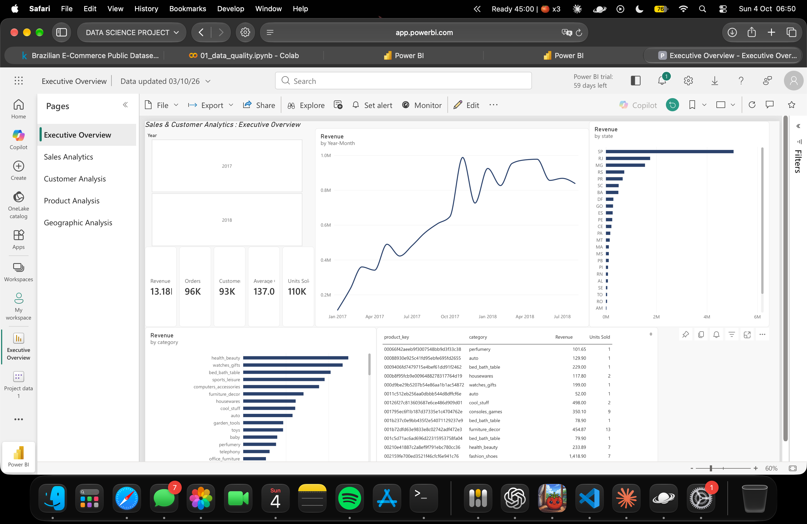
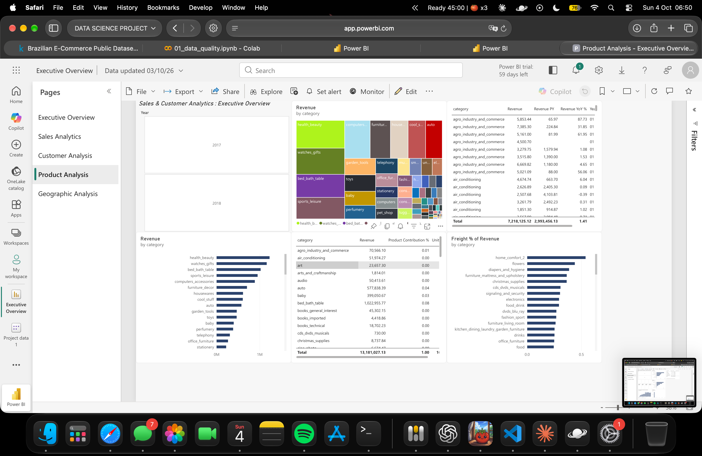
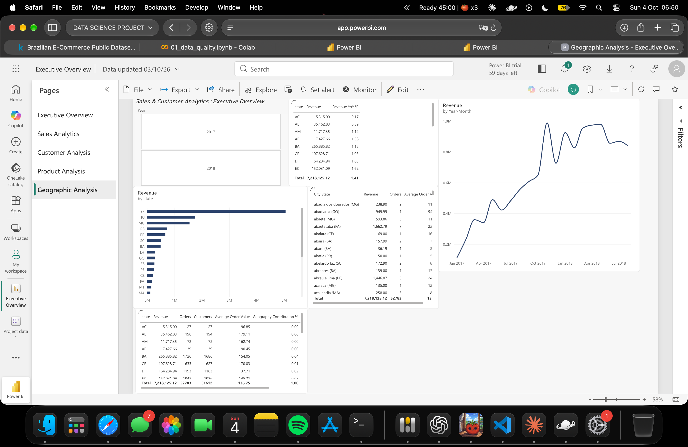

# Sales & Customer Analytics : End-to-End Business Intelligence Project

Projet de Data Analysis de bout en bout sur des données e-commerce réelles (Olist, Brésil) : qualité des données, nettoyage reproductible en Python, base analytique PostgreSQL, segmentation RFM, analyse exploratoire, modèle en étoile et dashboard Power BI de 5 pages.

> **Résumé chiffré** (commandes livrées, janvier 2017 - août 2018) : 13,18 M BRL de chiffre d'affaires, 96 211 commandes, 93 104 clients, panier moyen de 137,00 BRL. Chaque indicateur est recoupé entre SQL, Python et Power BI.

---

## Project Overview

| Élément | Détail |
|---|---|
| Objectif | Comprendre la performance commerciale, les produits, les clients et la géographie d'une place de marché |
| Données | Olist Brazilian E-Commerce (9 tables, environ 100 000 commandes) |
| Livrables | Rapport qualité, pipeline de nettoyage, base SQL, segmentation RFM, notebook EDA, dashboard Power BI, insights et recommandations |
| Pile | Python (pandas, matplotlib), PostgreSQL, Power BI (Service), Git |

## Business Problem

> La direction manque d'une vue consolidée des ventes, des produits et des clients. Elle ne sait pas précisément ce qui tire la croissance, quelles catégories et régions performent, ni si les clients reviennent.

## Objectives

1. Mesurer la performance commerciale (CA, commandes, panier moyen) et son évolution.
2. Identifier les catégories, produits et régions moteurs ou en retrait.
3. Caractériser la base clients (acquisition, récurrence, valeur) et la segmenter (RFM).
4. Livrer un dashboard Power BI utilisable par des non-techniciens.
5. Formuler des recommandations tirées uniquement des données.

## Dataset

- **Source** : [Olist Brazilian E-Commerce](https://www.kaggle.com/datasets/olistbr/brazilian-ecommerce) (Kaggle). Licence CC BY-NC-SA 4.0, usage non commercial avec attribution. Les fichiers ne sont pas versionnés : téléchargez-les depuis Kaggle.
- **Contenu** (lignes) : orders 99 441 · order_items 112 650 · order_payments 103 886 · order_reviews 99 224 · customers 99 441 · products 32 951 · sellers 3 095 · geolocation 1 000 163 · category_translation 71.
- **Période** : septembre 2016 à octobre 2018. **Fenêtre d'analyse retenue : janvier 2017 - août 2018** (2016 et septembre-octobre 2018 sont quasi vides).
- **Devise** : BRL.
- **Points d'attention** : `customer_id` est généré par commande (le vrai client est `customer_unique_id`) ; aucun coût (donc pas de marge) ni remise ; un seul pays.

## Architecture

```
CSV bruts (Kaggle)
   │
   ├─► PostgreSQL  schéma raw        copie fidèle, base du contrôle qualité (notebook 01)
   │
   ├─► Python      src/clean.py      nettoyage reproductible + journal + tests
   │        └─► data/processed/*.csv
   │
   ├─► PostgreSQL  schéma clean      tables typées avec clés primaires et étrangères
   │        └─► schéma analytics     vues fact_sales, v_orders, rfm_* (périmètre défini une seule fois)
   │                 └─► sql/20..63  analyses Ventes, Produits, Clients, Géographie, RFM
   │
   ├─► PostgreSQL  schéma bi         modèle en étoile (FactSales + 4 dimensions)
   │        └─► src/export_powerbi.py ─► classeur Excel (une table par feuille)
   │
   └─► Power BI Service              modèle sémantique, 20 mesures DAX, dashboard de 5 pages
```

**Modèle en étoile** (grain : une ligne de commande livrée)

| Table | Lignes | Clé |
|---|---|---|
| FactSales | 109 880 | (order_id, order_item_id) |
| DimCustomer | 93 104 | customer_key (= `customer_unique_id`), contient les scores RFM |
| DimProduct | 32 081 | product_key |
| DimGeography | 4 270 | geography_key (couple État, ville) |
| DimDate | 608 | Date Key / Date (généré en SQL, 2017-01-01 au 2018-08-31) |

Relations : dimension vers fait, cardinalité un-vers-plusieurs, filtre dans un seul sens.

## Data Cleaning

Pipeline `src/clean.py` : lit `data/raw`, écrit `data/processed` et un journal `reports/cleaning_log.csv`. **Rien n'est supprimé sans être journalisé et justifié.**

- Le périmètre (commandes livrées, janvier 2017 - août 2018) est porté par des **indicateurs** (`in_scope`), pas par des suppressions.
- Aucune ligne n'est supprimée sur `orders`, `order_items`, `customers`, `products`. Seules 2 règles suppriment des lignes, toutes deux sur `geolocation` (261 831 doublons exacts, 33 coordonnées hors du Brésil), avant agrégation à 19 010 codes postaux.
- Les anomalies (1 359 remises transporteur avant approbation, 8 commandes livrées sans date, etc.) sont conservées et signalées.
- Les valeurs aberrantes sont repérées (méthode IQR) mais conservées : distributions asymétriques naturelles.
- 11 tests automatiques (`tests/test_clean.py`) contrôlent clés uniques, prix positifs, cohérence du périmètre et absence de perte de lignes.

Détail : [`reports/data_quality_report.md`](reports/data_quality_report.md).

## SQL Analysis

Couches `raw` → `clean` → `analytics` → `bi`. Les requêtes utilisent CTE, jointures, `CASE WHEN`, agrégats avec `FILTER`, et fonctions de fenêtre (`LAG`, `LEAD`, `RANK`, `ROW_NUMBER`, `PERCENTILE_CONT`).

Exemple : croissance mensuelle (`LAG`) et classement des mois (`RANK`).

```sql
WITH monthly AS (
    SELECT order_month, SUM(revenue) AS revenue
    FROM analytics.v_orders
    GROUP BY order_month
),
with_prev AS (
    SELECT order_month, revenue,
           LAG(revenue) OVER (ORDER BY order_month) AS prev_revenue
    FROM monthly
)
SELECT order_month,
       ROUND(revenue, 2) AS revenue,
       ROUND(100.0 * (revenue - prev_revenue) / NULLIF(prev_revenue, 0), 1) AS mom_growth_pct,
       RANK() OVER (ORDER BY revenue DESC) AS revenue_rank
FROM with_prev
ORDER BY order_month;
```

Exemple : délai entre deux commandes d'un même client (`LEAD`).

```sql
WITH ordered AS (
    SELECT customer_unique_id, order_date,
           LEAD(order_date) OVER (PARTITION BY customer_unique_id
                                  ORDER BY order_date, order_id) AS next_order_date
    FROM analytics.v_orders
)
SELECT COUNT(*) AS repeat_intervals,
       ROUND(AVG(next_order_date - order_date), 1) AS avg_days_between,
       ROUND((PERCENTILE_CONT(0.5) WITHIN GROUP
             (ORDER BY next_order_date - order_date))::numeric, 1) AS median_days_between
FROM ordered
WHERE next_order_date IS NOT NULL;
```

| Fichier | Contenu |
|---|---|
| `sql/20_sales.sql`, `21_sales_checks.sql` | KPI, évolution mensuelle, MoM, YoY, contrôles |
| `sql/30_products.sql` | Top et flop produits, catégories, Pareto, évolution |
| `sql/40_customers.sql` | Nouveaux clients, actifs, fréquence, valeur |
| `sql/50_geography.sql` | CA par État et ville, évolution |
| `sql/60_rfm.sql` à `63_rfm_analysis.sql` | Segmentation RFM et analyse des segments |

## Customer Segmentation

Segmentation **RFM** sur 93 104 clients, date de référence 2018-09-01.

- **Récence** et **montant** : scores de 1 à 5 par seuils de percentiles (et non `NTILE`, pour que des clients ayant dépensé le même montant reçoivent le même score).
- **Fréquence** : jours d'achat distincts (1, 2, 3 ou plus). 97 % des clients n'ont acheté qu'une fois : des quantiles n'auraient aucun sens.
- Les noms de segments sont des **étiquettes analytiques définies par les règles ci-dessous**, pas des catégories business établies.

| Segment | Règle | Clients | % clients | % CA |
|---|---|---|---|---|
| Champions | F ≥ 2, R ≥ 4, M ≥ 4 | 833 | 0,9 % | 2,1 % |
| Loyal Customers | F ≥ 2, R ≥ 3 | 600 | 0,6 % | 0,9 % |
| At Risk | R ≤ 2 et (F ≥ 2 ou M ≥ 4) | 14 464 | 15,5 % | 30,5 % |
| Potential Loyalists | F = 1, R ≥ 4 | 36 263 | 38,9 % | 38,7 % |
| Lost Customers | F = 1, R ≤ 2, M ≤ 3 | 22 671 | 24,4 % | 9,6 % |
| Occasional Customers | les autres | 18 273 | 19,6 % | 18,2 % |

96 % des clients « At Risk » n'ont acheté qu'une fois : ce segment décrit des clients de forte valeur inactifs depuis plus de 270 jours, pas des clients dont la fidélité a été observée. Détail : [`reports/rfm_segmentation.md`](reports/rfm_segmentation.md).

## Power BI Dashboard

Dashboard de 5 pages construit dans **Power BI Service** : Executive Overview, Sales Analysis, Customer Analysis, Product Analysis, Geographic Analysis.

| Page | Capture |
|---|---|
| Executive Overview |  |
| Sales Analysis |  |
| Customer Analysis |  |
| Product Analysis |  |
| Geographic Analysis |  |

**Mesures DAX principales** (liste complète dans [`powerbi/measures.dax`](powerbi/measures.dax), 20 mesures dans une table `_Measures`) :

```dax
Revenue = SUM(FactSales[revenue])
Orders = DISTINCTCOUNT(FactSales[order_id])
Average Order Value = DIVIDE([Revenue], [Orders])

Revenue MoM % =
VAR Prev = [Revenue PM]
RETURN IF(HASONEVALUE(DimDate[Month Start]) && NOT ISBLANK(Prev),
          DIVIDE([Revenue] - Prev, Prev))

New Customers =
CALCULATE(DISTINCTCOUNT(FactSales[customer_key]), FactSales[is_first_purchase_day] = 1)

Product Contribution % =
DIVIDE([Revenue], CALCULATE([Revenue], ALL(DimProduct)))
```

**Marge** : non calculée, aucun coût dans les données. La page Produits affiche à la place le poids des frais de port, présenté comme un indicateur logistique et non comme une marge.

Les captures sont le livrable visuel : le rapport est privé dans l'espace de travail de l'auteur (licence gratuite).

## Key Insights

Analyse détaillée dans [`reports/business_insights.md`](reports/business_insights.md) (17 insights, chacun avec observation, donnée, interprétation, implication et limite).

- La croissance de janvier-août 2018 (+141 % de CA) vient du volume de commandes (+140 %), pas du panier (+0,5 %).
- La croissance suit l'acquisition : environ 97 à 98 % des clients actifs de chaque mois de 2018 sont nouveaux. Les nouveaux clients mensuels reculent d'environ 14 % entre janvier et juin 2018.
- 97 % des clients n'achètent qu'une fois ; le délai médian entre deux commandes est de 29 jours.
- Aucun produit vedette (top 10 : environ 3,4 % du CA) ; 18 catégories sur 74 réalisent 80 % du CA.
- Trois États (SP, RJ, MG) réalisent 63,4 % du CA, et São Paulo gagne des parts (36,1 % à 40,4 %).
- Les frais de port médians représentent 73,1 % de la valeur des commandes les moins chères et 6,4 % des plus chères.

## Business Recommendations

Détail dans [`reports/recommendations.md`](reports/recommendations.md). Les faits, les interprétations et les recommandations y sont séparés. Chaque recommandation est une hypothèse à tester, avec un indicateur de succès :

1. Tester une action de réachat sur les clients récents à achat unique.
2. Tester une réactivation ciblée des clients de forte valeur inactifs.
3. Diagnostiquer le ralentissement de l'acquisition (données d'acquisition à collecter).
4. Tester des mesures sur les frais de port des petites commandes.
5. Piloter l'assortiment par dynamique de catégorie.
6. Préparer les pics événementiels (24 novembre 2017 : 1 147 commandes en un jour).

## Technologies

Python 3.13 · pandas · NumPy · matplotlib · SQLAlchemy · psycopg2 · openpyxl · pytest · PostgreSQL · Power BI Service (modèle sémantique, DAX) · Git

## Installation

Prérequis : Python 3.13, PostgreSQL, un compte Kaggle (téléchargement du dataset).

```bash
git clone <url-du-depot>
cd sales-customer-analytics

python3 -m venv .venv
source .venv/bin/activate
pip install -r requirements.txt

# Téléchargez les 9 CSV Olist depuis Kaggle dans data/raw/
export PGPASSWORD='votre_mot_de_passe'
# Si PostgreSQL signale "No space left on device" (mémoire partagée) :
# export PGOPTIONS='-c max_parallel_workers_per_gather=0'
```

## How to Run

**Une seule fois : couche brute**
```bash
psql -h localhost -U postgres -c "CREATE DATABASE olist;"
psql -h localhost -U postgres -d olist -f sql/01_schema_raw.sql
psql -h localhost -U postgres -d olist -f sql/02_load_raw.sql
psql -h localhost -U postgres -d olist -f sql/03_check_counts.sql
```

**Pipeline reproductible : nettoyage, base analytique, modèle en étoile, export Power BI**
```bash
bash run_all.sh
```

**Analyses et notebooks**
```bash
psql -h localhost -U postgres -d olist -f sql/20_sales.sql          # puis 21, 30, 40, 50, 61, 63
jupyter notebook   # notebooks/01_data_quality.ipynb, notebooks/02_eda.ipynb
```

**Power BI Service** : importer `powerbi/data/olist_model.xlsx` (Create > Get data > Upload a file > Only create a semantic model), créer les 4 relations (voir Architecture), marquer `DimDate` comme table de dates (colonne `Date`), puis exécuter `powerbi/measures.dax` dans la DAX query view et enregistrer les mesures dans le modèle.

## Project Structure

```
sales-customer-analytics/
├── data/
│   ├── raw/                  CSV Olist d'origine (non versionnés)
│   └── processed/            sorties du pipeline (non versionnées)
├── notebooks/                01_data_quality, 02_eda
├── sql/                      schémas, chargements, analyses, RFM, modèle en étoile
├── src/                      db.py, clean.py, export_powerbi.py
├── powerbi/                  measures.dax, theme.json, screenshots/
├── reports/                  qualité des données, journal de nettoyage, RFM, insights, recommandations, figures
├── tests/                    test_clean.py
├── run_all.sh
├── README.md
├── requirements.txt
└── .gitignore
```

## Limitations

- **Aucun coût ni remise** : pas de marge, pas d'analyse de rentabilité.
- **Un seul pays et une seule période** (2017 - août 2018) : pas de saisonnalité annuelle établie (20 mois), croissance 2018 comparée sur 8 mois.
- **Faible récurrence** (97 % d'achats uniques) : la dimension fréquence du RFM discrimine peu, et le segment « At Risk » est composé à 96 % de clients à achat unique.
- **Seul le CA des commandes livrées** est analysé : les commandes en transit à la fin des données sont exclues (biais faible : 2,5 % de commandes non livrées en août 2018).
- **Écart de 303 commandes** entre le total des lignes d'articles et le total des paiements : non investigué. Le CA est calculé à partir des prix des articles.
- **Dashboard** : construit dans Power BI Service avec une licence gratuite, donc non partageable par lien. Le dépôt contient les captures d'écran et les mesures DAX, pas de fichier `.pbix`.
- **Produits sans nom** : identifiants anonymisés.
- Les causes des tendances (marketing, concurrence, événements) ne sont pas observables dans ces données.

## Future Improvements

- Analyser les délais de livraison et les avis clients.
- Rapprocher la localisation des vendeurs de celle des clients pour expliquer les frais de port.
- Investiguer l'écart de 303 commandes entre articles et paiements.
- Ajouter une prévision du CA (sur davantage de recul historique).
- Automatiser le pipeline (orchestration, rafraîchissement du modèle).
- Intégrer des coûts (si disponibles) pour calculer la marge.

## Source et licence des données

Données : Olist, via Kaggle, licence CC BY-NC-SA 4.0. Ce projet est un projet de portfolio non commercial.
